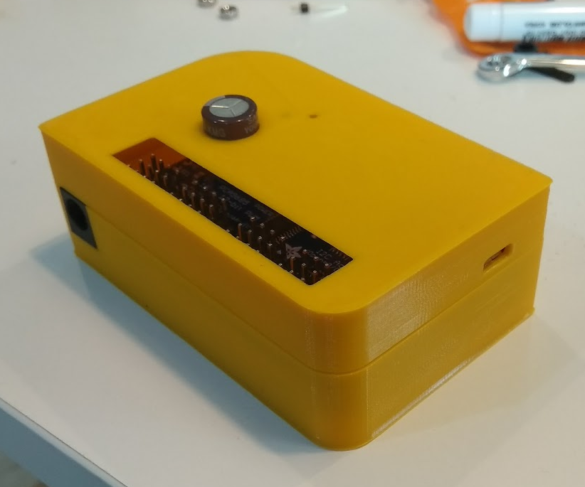
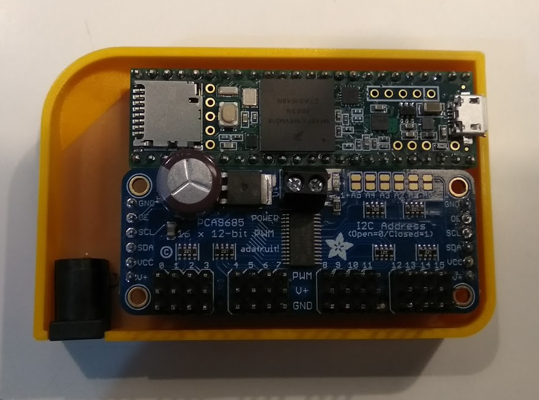
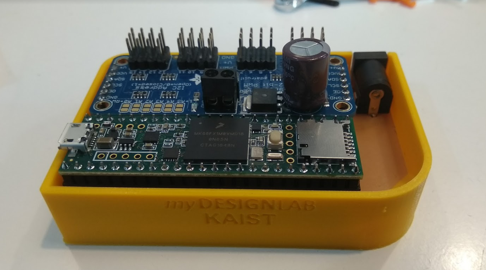

# Servo Controller PCB w/Case

This PCB integrates a Teensy 3.6 with Adafruit's Servo Motor Controller, and a DC power input.
Includes a 3D printable case.

 

## How to use?
### What you need:
 - Solder Iron
 - Solder Wire
 - [Teensy 3.6](https://www.sparkfun.com/products/14057)
 - [Adafruit's Servo Driver](https://www.adafruit.com/product/815)
 - DC Power Plug
 - Female / Male Pin Headers
> This build assumes you know how to make a PCB.

### PCB
1. Make the PCB with your prefered method.
1. Solder `female headers` to the board if you want to be able to reuse the **Teensy** and **Adafruit's Servo Motor** modules.
1. Cut the **USB Power** connection from the **Teensy**.
1. Solder `male headers` to the **modules** and a `DC power plug` to the **board**.
1. `Attention!!!` Make sure to assemble the modules in the correct orientation.

 

### 3D Print Case
1. You can directly print the `.stl` files ([case](3D%20Case/Case.stl) / [lid](3D%20Case/Lid.stl)) provided or open the Fusion 360 [file](3D%20Case/Fusion%20360%20Files/Case.f3d) and export the file to your preferred 3D Print software.
1. Fit the **PCB** inside the **case**.
1. Close the **case** with the **lid**.
1. Done!

## About this project
This project is part of the **Digital Fabrication** course at **KAIST**, South Korea.